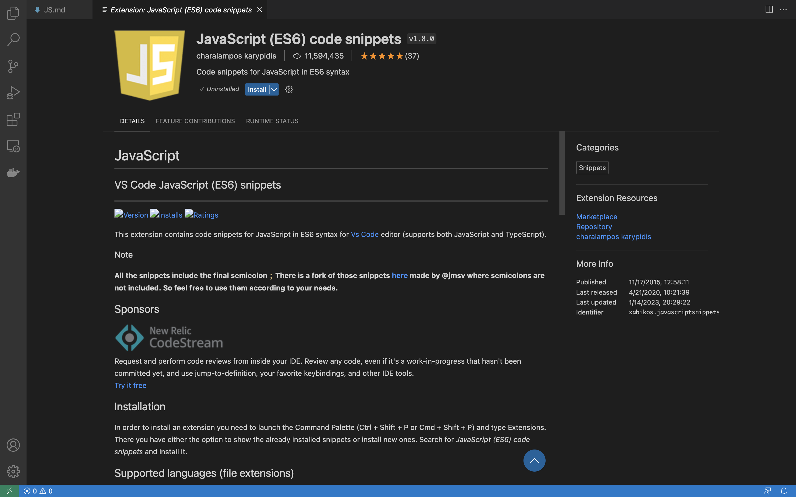
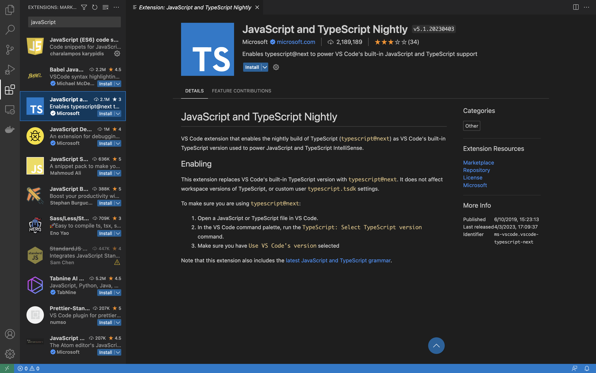

# What is JavaScript?

JavaScript is the most common coding language. It is a text-based coding language that is used to create applications, interactive web content, and web browsers. An example of JavaScript would be a search bar, refresh button, or playing a video that is linked to Youtube. Unlike Java, which creates applications that run in a virtual machine or browser, JavaScript code is run on a browser only. Java code needs to be compiled while JavaScript code is all in text.

## Getting Started

If you want to learn how to code in JavaScript, all you need is motivation and dedication. This language is very easy to learn. There are many websites and content creators who offer paid and free courses in JavaScript. If you want to get started on Visual Studio Code, follow these steps and you can become proficient in JavaScript.

---

### Starting on Visual Studio Code

- **Download Visual Studio Code** from your web browser, you can do this by going to [Visual Studio Code](https://code.visualstudio.com/Download) and downloading it from there.
  
- Once you have it up and running, go to the **sidebar** and go to extensions.
- There you can search which **JavaScript extension** is available for code snippets.
- Since VS Code already has JavaScript IntelliSense, debugging, formatting, code navigation, and refactorings. All you need to do is **download JavaScript (ES6) code snippets**.
  


- These snippets will help since they are templates that make it easier to enter repeating code patterns, like loops or conditional statements.
- With everything downloaded and running, you start to learn the language and start a project to familiarize yourself with it.
  
---

Some ideas for a first project are a stopwatch, clock, making the pong game, calculato879r, or a "guess the color" game.

Once you have gotten used to JavaScript, try to learn TypeScript:



In order to run aa javscript file, make sure to have the "Node.js Extension Pack" in the VS Code extensions and download node.js here: [Download node.js to run javascript files here](https://nodejs.org/en?ref=altcademy.com). Of course, using an html file would also work, but this is if you only want to use javascript files. Once you have everything downloaded, make a "intro.js" file, and then you can do this:

```javascript
console.log("Hello World!)
```

After you have done this, you can open the terminal and type the following:

```bash
node intro.js
```

After that, it should show the output and all will be well. Okay good luck!

### Review Questions

1. What is the difference between Java and JavaScript?
2. What do you need to learn?
3. Where can you download Visual Studio Code?
4. What extension should you get for JavaScript?
5. What are snippets used for?

---
***Here's some other information if you want***:

- [Cheatsheet #1](https://htmlcheatsheet.com/js/)
- [Cheatsheet #2](https://www.codecademy.com/learn/introduction-to-javascript/modules/learn-javascript-introduction/cheatsheet)
- [Cheatsheet #3](https://developer.mozilla.org/en-US/docs/Learn/JavaScript/First_steps/A_first_splash)
- [VS Code Intro to JavaScript](https://code.visualstudio.com/docs/languages/javascript)
- [8-Hour Youtube Video](https://www.youtube.com/watch?v=Qqx_wzMmFeA)
- [1-Hour Youtube Video](https://www.youtube.com/watch?v=W6NZfCO5SIk)
- [Other Info](https://mikkegoes.com/learn-to-code-for-free/)
  